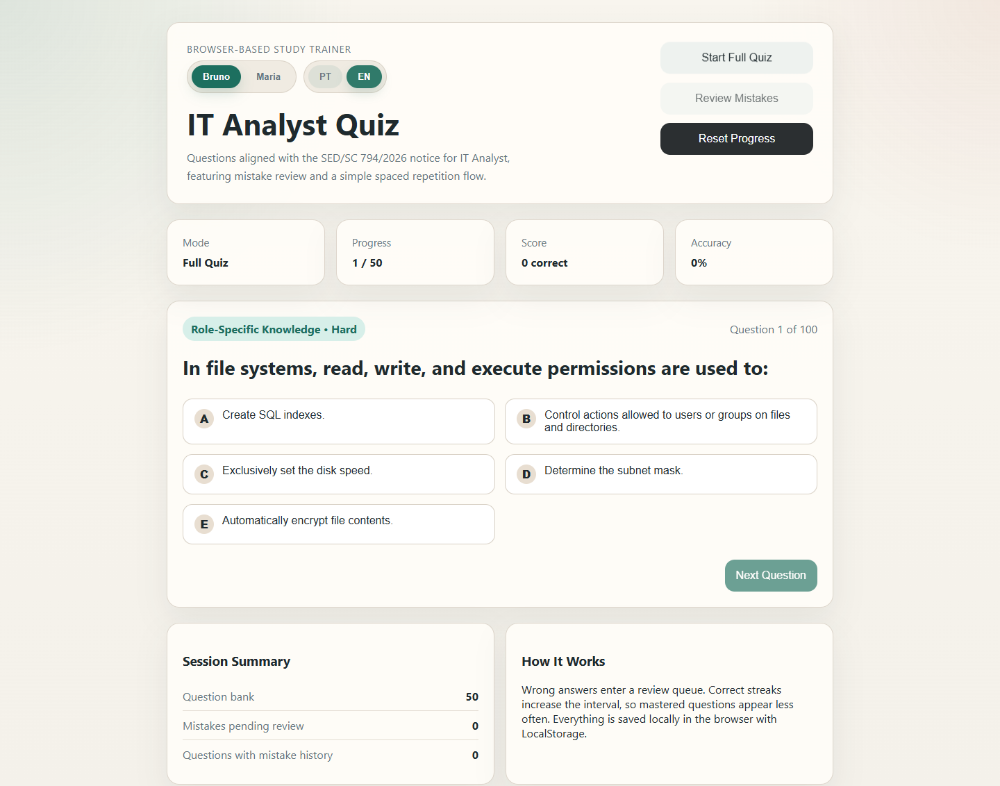
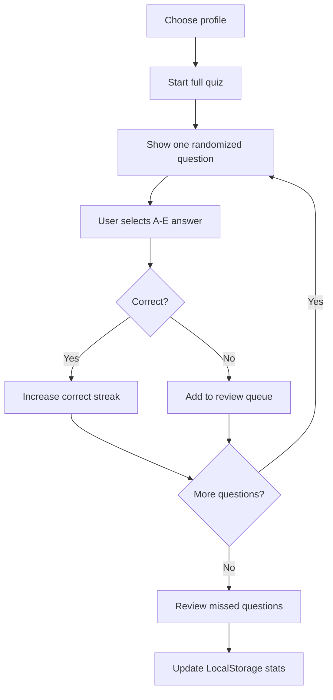

# Quiz Contest

[](#tech-stack)
[](#architecture)
[](#how-it-works)
[](#internationalization)

A fully client-side quiz trainer built for contest preparation. It runs as a static GitHub Pages site, saves study progress in the browser, randomizes questions and answers, and uses an Anki-inspired review queue for missed questions.

Live demo: [https://degsterin.github.io/quiz-contest/](https://degsterin.github.io/quiz-contest/)

Repository: [https://github.com/DegsTerin/quiz-contest](https://github.com/DegsTerin/quiz-contest)



## What Makes It Portfolio-Ready

This project demonstrates a complete static web application without a backend. It includes state persistence, dynamic rendering, randomized sessions, profile switching, bilingual UI controls, and a learning loop inspired by spaced repetition.

The content is tailored to Brazilian public contest preparation, while the interface can be used in Portuguese or English. Portuguese is the default language because the question banks are based on Brazilian exam notices.

## Main Features

| Feature | Description |
| --- | --- |
| Multiple profiles | Switch between two independent study profiles without mixing progress. |
| Question bank | 100 total sample questions split across two contest profiles. |
| Randomization | Questions and answer alternatives are shuffled every session. |
| Paper-style alternatives | Answers are displayed as A, B, C, D, and E, like a printed exam. |
| Immediate feedback | Users see whether the answer is correct and get an explanation. |
| Review queue | Missed questions are saved and repeated after the main round. |
| Basic spaced repetition | Correct streaks reduce how often a question appears again. |
| Local persistence | Progress, accuracy, streaks, and review status are stored in LocalStorage. |
| Bilingual experience | Portuguese is default; English translates the interface, questions, alternatives, and feedback explanations. |
| GitHub Pages ready | No build step, no server, no external libraries. |

## How It Works

1. The user selects a profile: Bruno or Maria.
2. The app loads the matching question bank from `questions.js`.
3. A full quiz session shuffles all questions.
4. Each question shows one prompt and five randomized alternatives.
5. When the user answers, the app displays immediate feedback.
6. Incorrect answers enter a review queue.
7. After the full round, missed questions come back for review.
8. If a question is answered correctly multiple times, it appears less often.
9. Progress is saved locally in the browser using LocalStorage.

<details>
<summary><strong>Study Flow Diagram</strong></summary>



</details>

## Internationalization

The app supports two languages:

| Language | Behavior |
| --- | --- |
| Portuguese | Default language for the complete quiz experience. |
| English | Portfolio-friendly translation for the interface, question prompts, answer alternatives, and feedback explanations. |

The English question bank is stored statically in `questions-en.js`, so the deployed app does not depend on any external translation service at runtime.

## Architecture

```text
quiz-contest/
  index.html       Static HTML structure
  style.css        Responsive styling and visual system
  app.js           Quiz engine, i18n, LocalStorage, review logic
  questions.js     Question banks and profile metadata
  questions-en.js  English translations for prompts, answers, and explanations
  docs/
    screenshot.png README screenshot
```

No backend is required. The browser loads JavaScript directly, renders the current profile, and persists progress locally.

## Tech Stack

- HTML5
- CSS3
- Vanilla JavaScript
- LocalStorage
- GitHub Pages

## Question Banks

| Profile | Target |
| --- | --- |
| Bruno | IT Analyst exam preparation based on SED/SC 794/2026. |
| Maria | AEE/Mixed and Libras Interpreter teacher roles based on SED/SC 793/2026. |

The project currently includes 50 questions per profile, for 100 total questions.

The questions are original simulated items. They were redesigned to follow the structure commonly seen in FURB-style exams, including assertion analysis, true/false sequences, column matching, scenario-based prompts, and closely related distractors. They are not verbatim copies of previous exams.

## LocalStorage Model

The app stores one progress object per profile. Each question tracks:

- total correct answers
- total incorrect answers
- current correct streak
- last result
- review status
- number of review attempts

This keeps each profile independent while still allowing the same quiz engine to power both.

## Running Locally

Because this is a static app, no installation is required.

```bash
git clone https://github.com/DegsTerin/quiz-contest.git
cd quiz-contest
```

Then open `index.html` in a browser.

You can also use any simple static server:

```bash
python -m http.server 8000
```

Then visit:

```text
http://localhost:8000
```

## GitHub Pages

The app is designed to run directly from the repository root on GitHub Pages:

```text
Branch: main
Folder: /
```

## Design Notes

- The visual style uses warm paper-like tones to evoke a study environment.
- Answer alternatives use circular labels to resemble physical exam sheets.
- The dashboard keeps the learning loop visible: mode, progress, score, and accuracy.
- The app avoids dependencies so it remains easy to host, inspect, and maintain.

## Future Improvements

- Add import/export for progress backup.
- Add filters by category and difficulty.
- Add full question-bank translation support.
- Add charts for accuracy by subject.
- Add keyboard shortcuts for A-E answers.
